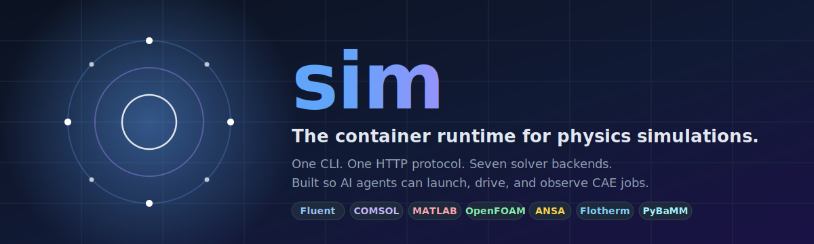

<div align="center">



<br>

**Make every engineering tool agent-native.**

*Today's CAD and CAE software was built for engineers clicking through GUIs.*
*Tomorrow's user is an LLM agent — and it needs a way in.*

<p align="center">
  <a href="#-quick-start"></a>
  <a href="#-supported-solvers"></a>
  <a href="https://github.com/svd-ai-lab/sim-skills"></a>
  <a href="LICENSE"></a>
</p>

<p align="center">
  
  
  
  
  
</p>

**English** · [Deutsch](docs/README.de.md) · [日本語](docs/README.ja.md) · [中文](docs/README.zh.md)

[Why sim](#-why-sim) · [Quick Start](#-quick-start) · [Demo](#-demo) · [Commands](#-commands) · [Solvers](#-supported-solvers) · [Skills](https://github.com/svd-ai-lab/sim-skills)

</div>

---

## 📰 News

- **2026-04-07** 🚀 **sim-cli v0.2.0** — first public release on GitHub. Rebrand of `svd-ai-lab/ion @ feature/openfoam-driver`. The driver registry now spans CFD, multiphysics, thermal, structural pre-processing, and battery solvers — and is designed to keep growing.
- **2026-04-07** 🧠 Companion repo [`sim-skills`](https://github.com/svd-ai-lab/sim-skills) published — per-solver agent skills in the Anthropic skill format, so an LLM can drive each new backend without prior context.

---

## 🤔 Why sim?

LLM agents already know how to write PyFluent, MATLAB, COMSOL, and OpenFOAM scripts — training data is full of them. What they *don't* have is a standard way to **launch a solver, drive it step by step, and observe what happened** before deciding the next move.

Today, the choices are awful:

- **Fire-and-forget scripts** — agent writes 200 lines, runs the whole thing, an error at line 30 surfaces as garbage at line 200, no introspection, no recovery.
- **Bespoke wrappers per solver** — every team rebuilds the same launch / exec / inspect / teardown loop in a different shape.
- **Closed proprietary glue** — vendor SDKs that don't compose, don't share a vocabulary, and don't speak HTTP.

`sim` is the missing layer:

- **One CLI**, one HTTP protocol, **a growing driver registry** spanning CFD, multiphysics, thermal, pre-processing, and beyond.
- **Persistent sessions** the agent introspects between every step.
- **Remote-by-default** — the CLI client and the live solver can sit on different machines (LAN, Tailscale, HPC head node).
- **Companion agent skills** that teach an LLM how to drive each backend safely.

> Like a container runtime standardized how Kubernetes talks to containers, **sim** standardizes how agents talk to solvers.

---

## 🏛 Architecture

<div align="center">
  
</div>

Two execution modes from the same CLI, sharing the same `DriverProtocol`:

| Mode | Command | When to use it |
|---|---|---|
| **Persistent session** | `sim serve` + `sim connect / exec / inspect` | Long, stateful workflows the agent inspects between steps |
| **One-shot** | `sim run script.py --solver X` | Whole-script jobs you want stored as a numbered run in `.sim/runs/` |

For the full driver protocol, server endpoints, and execution pipeline see [CLAUDE.md](CLAUDE.md).

---

## 🚀 Quick Start

```bash
# 1. On the box that has the solver (e.g. a Fluent workstation), install
#    sim core only — no SDK choices yet:
uv pip install "git+https://github.com/svd-ai-lab/sim-cli.git"

# 2. Tell sim to look at this machine and pick the right SDK profile:
sim check fluent
# → reports detected Fluent installs and the profile they resolve to

# 3. Bootstrap that profile env (creates .sim/envs/<profile>/ with the
#    pinned SDK; or pass --auto-install to step 4 to do it inline):
sim env install pyfluent_0_38_modern

# 4. Start the server (only needed for remote / cross-machine workflows):
sim serve --host 0.0.0.0          # FastAPI on :7600

# 5. From the agent / your laptop / anywhere on the network:
sim --host <server-ip> connect --solver fluent --mode solver --ui-mode gui
sim --host <server-ip> inspect session.versions   # ← always do this first
sim --host <server-ip> exec "solver.settings.mesh.check()"
sim --host <server-ip> screenshot -o shot.png
sim --host <server-ip> disconnect
```

That's the full loop: **detect → bootstrap → launch → drive → observe → tear down** — with the engineer optionally watching the solver GUI in real time.

> **Why the bootstrap step?** Each (Solver, SDK, driver, skill) combo is its own
> compatibility universe — Fluent 24R1 needs PyFluent 0.37.x; Fluent 25R2 wants
> 0.38.x. sim treats each as an isolated "profile env" so you can have both
> versions on one machine without dependency conflicts. The full design is in
> [`docs/architecture/version-compat.md`](docs/architecture/version-compat.md).

---

## 🎬 Demo

> **Recording in progress.** A short terminal capture of `sim connect → exec → inspect → screenshot` against a real Fluent session will land here. The exact sequence to record:
>
> ```bash
> sim serve --host 0.0.0.0
> sim --host <ip> connect --solver fluent --mode solver --ui-mode gui --auto-install
> sim --host <ip> inspect session.versions    # ← step 0: which profile am I in?
> sim --host <ip> exec "solver.settings.file.read_case(file_name='mixing_elbow.cas.h5')"
> sim --host <ip> exec "solver.settings.solution.initialization.hybrid_initialize()"
> sim --host <ip> exec "solver.settings.solution.run_calculation.iterate(iter_count=20)"
> sim --host <ip> inspect session.summary
> sim --host <ip> disconnect
> ```
>
> Want to contribute the recording? Use [`vhs`](https://github.com/charmbracelet/vhs) or [`asciinema`](https://asciinema.org/) and open a PR against `assets/demo.gif`.

---

## ✨ Features

### 🧠 Built for agents
- **Persistent sessions** that survive across snippets — never restart the solver mid-task
- **Step-by-step introspection** with `sim inspect` between every action
- **Pre-flight `sim lint`** catches missing imports and unsupported APIs before launch
- **Numbered run history** in `.sim/runs/` for one-shot jobs, browsable via `sim logs`

### 🔌 Solver-agnostic
- **One protocol** (`DriverProtocol`) — every driver is ~200 LOC, registered in `drivers/__init__.py`
- **Persistent + one-shot** from the same CLI — no separate client per mode
- **Open registry** — new solvers land continuously; CFD, multiphysics, thermal, pre-processing, battery models all in scope
- **Companion skills** in [`sim-skills`](https://github.com/svd-ai-lab/sim-skills) so an LLM picks up each new backend without prior context

### 🌐 Remote-friendly
- **HTTP/JSON transport** — runs anywhere `httpx` runs
- **Client / server split** — agent on a laptop, solver on an HPC node, GUI on a workstation
- **Tailscale-ready** — designed for cross-network mesh deployments

---

## ⚙️ Commands

| Command | What it does | Analogy |
|---|---|---|
| `sim check <solver>` | Detect installations + resolve a profile | `docker info` |
| `sim env install <profile>` | Bootstrap a profile env (venv + pinned SDK) | `pyenv install` |
| `sim env list [--catalogue]` | Show bootstrapped envs (and the full catalogue) | `pyenv versions` |
| `sim env remove <profile>` | Tear down a profile env | `pyenv uninstall` |
| `sim serve` | Start the HTTP server (for cross-machine use) | `ollama serve` |
| `sim connect` | Launch a solver, open a session | `docker start` |
| `sim exec` | Run a Python snippet inside the live session | `docker exec` |
| `sim inspect` | Query live session state (incl. `session.versions`) | `docker inspect` |
| `sim ps` | Show the active session and its profile | `docker ps` |
| `sim screenshot` | Grab a PNG of the solver GUI | — |
| `sim disconnect` | Tear down the session | `docker stop` |
| `sim run` | One-shot script execution | `docker run` |
| `sim lint` | Pre-flight static check on a script | `ruff check` |
| `sim logs` | Browse stored run history | `docker logs` |

Every command that touches a host (`check`, `env`, `connect`, `exec`, `inspect`, `disconnect`) accepts `--host <ip>` and runs against a remote `sim serve` instead of the local machine.

Environment: `SIM_HOST`, `SIM_PORT` for the client; `SIM_DIR` (default `.sim/`) for run storage and profile envs.

### Choosing a profile

You don't usually have to. `sim check <solver>` tells you which profile your installed solver maps to, and `sim connect ... --auto-install` will bootstrap it for you on first use. The escape hatches:

- **Pin a specific profile:** `sim connect --solver fluent --profile pyfluent_0_37_legacy`
- **Skip the profile env entirely (legacy / tests):** `sim connect --solver fluent --inline`
- **Power-user single-env install:** `pip install 'sim-cli[fluent-pyfluent-0-38]'` puts the SDK directly into your current venv. Skips `sim env` entirely; OK when you only need one Fluent version on this machine.

The full design is in [`docs/architecture/version-compat.md`](docs/architecture/version-compat.md).

---

## 🆚 Why not just run scripts?

| Fire-and-forget script | sim |
|---|---|
| Write the whole thing, run, hope it converges | Connect → execute → observe → decide next step |
| An error at step 2 surfaces at step 12 | Each step verified before the next is sent |
| Agent has no view of solver state | `sim inspect` between every action |
| Solver restarts on every iteration | One persistent session, snippets at will |
| GUI invisible to the human | Engineer watches the GUI while the agent drives |
| Output parsing reinvented per project | `driver.parse_output()` returns structured fields |

---

## 🧪 Solver registry

The driver registry is **open and intentionally growing** — adding a new backend is a ~200-LOC `DriverProtocol` implementation plus one line in `drivers/__init__.py`. Below is a snapshot of what currently ships in `main`:

| Domain | Example backends shipping today | Sessions | Status |
|---|---|---|---|
| CFD | Ansys Fluent, OpenFOAM | persistent / one-shot | ✅ Working |
| Multiphysics | COMSOL Multiphysics | one-shot | ✅ Working |
| Pre-processing | BETA CAE ANSA | persistent / one-shot | ✅ Working (Phase 1) |
| Electronics thermal | Simcenter Flotherm | one-shot | ✅ Working (Phase A) |
| Numerical / scripting | MATLAB | one-shot | ✅ Working (v0) |
| Battery modeling | PyBaMM | one-shot | ✅ Working |
| **+ your solver** | open a PR — see [Adding a driver](#-development) | — | 🛠 |

Per-solver protocols, snippets, and demo workflows live in [`sim-skills`](https://github.com/svd-ai-lab/sim-skills), which is **also designed to grow** alongside the driver registry — one new agent skill per new backend.

---

## 🛠 Development

```bash
git clone https://github.com/svd-ai-lab/sim-cli.git
cd sim-cli
uv pip install -e ".[dev]"

pytest -q                       # unit tests (no solver needed)
pytest -q -m integration        # integration tests (need solvers + sim serve)
ruff check src/sim tests
```

Adding a new driver? Drop a `DriverProtocol` implementation under `src/sim/drivers/<name>/driver.py`, register it in `drivers/__init__.py`, and you're done. See `pybamm/driver.py` for the smallest reference; `fluent/` for a full persistent-session example.

---

## 📂 Project layout

```
src/sim/
  cli.py           Click app, all subcommands
  server.py        FastAPI server (sim serve)
  session.py       HTTP client used by connect/exec/inspect
  driver.py        DriverProtocol + result dataclasses
  drivers/
    fluent/        Reference example: persistent-session driver
                   (driver.py + runtime.py + queries.py)
    pybamm/        Reference example: smallest one-shot driver
    …              and more — one folder per registered backend
    __init__.py    DRIVERS registry — register new backends here
tests/             unit tests + fixtures + execution snippets
assets/            logo · banner · architecture (SVG)
docs/              translated READMEs (de · ja · zh)
```

---

## 🌐 Remote deployment

When the solver lives on a different machine (a Fluent workstation, an HPC login node, a lab box) and you want to drive it from your laptop, a notebook, or an LLM agent — install `sim-cli` on **both** ends and run `sim serve` on the remote.

```bash
# On the solver host (the machine with Fluent / COMSOL / OpenFOAM / ... installed)
ssh user@solver-host
pip install git+https://github.com/svd-ai-lab/sim-cli.git
sim serve --host 0.0.0.0 --port 7600     # bind to all interfaces

# On your local control machine
sim --host <solver-host-ip> connect --solver fluent --mode meshing
sim --host <solver-host-ip> exec "session.settings.mesh.check()"
sim --host <solver-host-ip> inspect session.summary
sim --host <solver-host-ip> disconnect
sim --host <solver-host-ip> stop          # shut down the remote server when done
```

That is the entire setup — same `sim-cli` package on both sides, same wire protocol whether it is talking to a local or a remote server. Bind `--host 0.0.0.0` only on networks you trust (Tailscale, VPN, LAN behind a firewall); there is **no auth layer** on `/connect` and `/exec` execute arbitrary Python.

---

## 🔗 Related projects

- **[`sim-skills`](https://github.com/svd-ai-lab/sim-skills)** — agent skills, snippets, and demo workflows for each supported solver

---

## 📄 License

Apache-2.0 — see [LICENSE](LICENSE).
