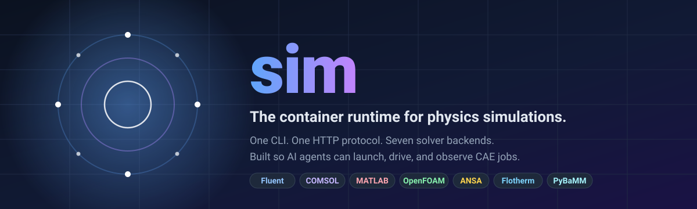

<div align="center">



<br>

**Let AI agents operate real CAE and physics solvers step by step.**

`sim` is an open-source CLI and local runtime that lets Codex, Claude Code,
GitHub Copilot, Gemini, and other agents work with simulation software through
solver-specific plugins and bundled skills. An agent can check what is
installed, connect to a solver, inspect live state, execute bounded steps,
capture artifacts, and leave checkpoints for an engineer to review.

<p align="center">
  <a href="#quick-start-agent-setup"></a>
  <a href="#solver-plugins"></a>
  <a href="LICENSE"></a>
</p>

<p align="center">
  
  
  
  
  
</p>

[Quick Start](#quick-start-agent-setup) · [COMSOL + Codex](#example-comsol-and-codex-on-one-machine) · [Agent Loop](#the-agent-loop) · [Remote Solvers](#local-vs-remote-solvers) · [Plugins](#solver-plugins) · [Commands](#common-commands)

</div>

---

## Who this is for

`sim` is for agents and people trying to get real simulation work done.

- **CAE engineers who already script solvers** and want an agent to help
  automate COMSOL, Fluent, MATLAB, LTspice, Abaqus, HFSS, and similar tools
  without losing inspection and recovery between steps.
- **Design engineers and occasional simulation users** who have agent
  experience and want a "vibe CAE" workflow: ask for a simulation, watch the
  model evolve, review screenshots or plots, and keep final artifacts.
- **AI agents** reading this repository to learn the safe setup and operating
  loop before touching a solver.
- **Engineering leaders** evaluating whether agent-assisted simulation can be
  repeatable, reviewable, and compatible with existing solver installations.

Plugin authoring, runtime internals, and driver protocol details live in
[docs/DEVELOPMENT.md](docs/DEVELOPMENT.md).

## What sim gives an agent

LLMs can often write solver scripts, but a one-shot script is a weak workflow:
it hides intermediate state, fails late, and makes recovery difficult.

`sim` gives an agent a small, repeatable control surface:

```text
check solver -> connect -> inspect -> execute one bounded step
-> inspect result/state -> save artifact or checkpoint -> continue
```

The solver-specific knowledge is not baked into the core CLI. It comes from
plugins. A plugin can provide both:

- a **driver**, so `sim` can launch or talk to the solver
- a **skill**, so the agent knows the solver-specific workflow, pitfalls, and
  inspection rules

## Human-in-the-loop collaboration

`sim` is designed for shared control, not unattended black-box automation.
When a solver plugin exposes live state through `sim inspect`, the agent can
re-read the current solver session after each meaningful step. That means an
engineer can cut in through the solver GUI, change geometry, parameters,
boundary conditions, plots, or saved artifacts, then ask the agent to inspect
again and continue from the real current state.

This is the collaboration model: the human can watch, correct, and steer; the
agent keeps using inspection and checkpoints instead of assuming its previous
script still matches the real solver state.

## Quick Start: agent setup

Use this path when the agent and solver are on the same machine. You do not
need to start `sim serve` manually for the local happy path; `sim connect`
will use the local runtime.

Prerequisite: install [`uv`](https://docs.astral.sh/uv/) if you do not already
have a Python tool manager.

With the recommended `uv tool install sim-cli-core` setup:

- the `sim` executable is placed in `$(uv tool dir --bin)`, usually
  `~/.local/bin/sim`
- `sim-cli-core` lives in its own uv-managed tool environment under
  `$(uv tool dir)/sim-cli-core`, usually
  `~/.local/share/uv/tools/sim-cli-core`
- `sim plugin install ...` installs the plugin package into the Python
  environment running `sim`, so by default plugins go into that same
  `sim-cli-core` tool environment and are visible to that `sim` executable
- plugins are independent Python distributions; current plugin discovery still
  uses Python entry points from the environment running `sim`
- synced skills are separate files for agents to read; they go to
  `.agents/skills` or `.claude/skills`

Use `.agents/skills` for Codex and GitHub Copilot projects. Use
`.claude/skills` for Claude Code projects.

```bash
# 1. Install the sim CLI.
uv tool install sim-cli-core

# 2. Discover available solver plugins.
sim plugin catalog

# 3. Install the plugin for the solver you want.
sim plugin install sim-plugin-comsol

# 4. Make the plugin's bundled skill visible to Codex or Copilot in this project.
sim plugin sync-skills --target .agents/skills --copy

# 5. Check that sim can see the solver on this machine.
sim check comsol

# 6. Verify the plugin and, with --deep, the local solver detection path.
sim plugin doctor comsol --deep
```

For **Claude Code**, use the project-local Claude target:

```bash
sim plugin install sim-plugin-comsol
sim plugin sync-skills --target .claude/skills --copy
```

If you omit `--target`, the CLI uses Claude-oriented defaults:
`./.claude/skills` when the project has a `./.claude/` directory, otherwise
`~/.claude/skills`.

`sim plugin install` runs skill sync automatically unless you pass
`--no-sync`. For Codex or Copilot, run the
`sync-skills --target .agents/skills --copy` command after install when you
want the skill materialized inside the project.

## Hand this prompt to your agent

After setup, give your coding agent a direct instruction like this:

```text
Use the solver skill installed under .agents/skills. Use sim-cli to check my
local solver installation before connecting. Work one bounded step at a time:
connect, inspect the session, execute a small step, inspect last.result and the
live model state, then save or update a checkpoint before continuing. Do not
guess solver API names; inspect the live model or the solver's local docs first.
If I make manual changes in the solver UI, re-inspect the live state before
continuing instead of assuming your previous script still matches the model.
Report saved artifacts, numerical checks, warnings, and anything that still
needs human engineering review.
```

For Claude Code, replace `.agents/skills` with `.claude/skills`.

## Example: COMSOL and Codex on one machine

If COMSOL and Codex are on the same machine, start by installing the COMSOL
plugin and syncing its bundled skill into the `.agents/skills` project target:

```bash
uv tool install sim-cli-core
sim plugin install sim-plugin-comsol
sim plugin sync-skills --target .agents/skills --copy
sim check comsol
sim plugin doctor comsol --deep
```

Then ask Codex:

```text
Use the COMSOL skill under .agents/skills. Start by checking COMSOL through
sim-cli. If you need a visible live COMSOL Desktop session, use:

sim connect --solver comsol --ui-mode gui --driver-option visual_mode=shared-desktop

After connecting, inspect session.health and comsol.model.identity. Confirm the
live model binding is healthy before treating the GUI as synchronized. For
non-trivial work, establish a case folder and save .mph checkpoints after major
layers. Build and solve one bounded step at a time.
```

For COMSOL-specific details such as shared Desktop mode, offline `.mph`
inspection, Desktop attach fallback, model identity checks, and checkpoint
policy, follow the bundled COMSOL skill.

## The agent loop

For any solver, the agent should prefer this loop over one large generated
script:

1. `sim check <solver>` to detect installed solver versions and plugin
   compatibility.
2. `sim connect --solver <solver> ...` for live stateful work, or `sim run`
   for a deterministic one-shot script.
3. `sim inspect session.versions` and the solver-specific health or identity
   target before changing state.
4. `sim exec --file step.py --label <step>` for one bounded modeling or
   analysis step.
5. `sim inspect last.result` and solver-specific state before continuing.
6. Save checkpoints and artifacts when the solver plugin or skill requires
   them.
7. `sim disconnect` when the session is done.

Screenshots and plots help humans review the result, but engineering
acceptance should prefer numeric evidence when the solver skill defines it:
mesh statistics, convergence, finite probes, conservation checks, tolerances,
or expected trends.

## Local vs remote solvers

**Same machine:** install `sim-cli-core` and the solver plugin locally, sync
the skill to your agent, then use `sim connect`. Do not add `--host` unless
you are intentionally talking to a remote `sim serve`.

**Remote solver workstation, lab box, or HPC login node:** install
`sim-cli-core` and the solver plugin on the solver host, start `sim serve`
there, then point the local agent at that host:

```bash
# On the solver host.
sim serve --host 0.0.0.0 --port 7600

# On the agent/control machine.
sim --host <solver-host-ip> check <solver>
sim --host <solver-host-ip> connect --solver <solver>
sim --host <solver-host-ip> inspect session.summary
sim --host <solver-host-ip> disconnect
```

Only bind `sim serve` to a trusted network such as a VPN, Tailscale, or a
protected LAN. The runtime currently has no auth layer, and `/connect` plus
`/exec` can execute solver-side code.

## Solver plugins

`sim-cli-core` ships with no solver drivers built in. Each simulation solver is
reached through an explicit plugin package.

Ready-to-use plugins:

| Solver | Install |
| --- | --- |
| COMSOL | `sim plugin install sim-plugin-comsol` |
| MATLAB / Simulink | `sim plugin install git+https://github.com/svd-ai-lab/sim-plugin-matlab@main` |
| Ansys Workbench | `sim plugin install sim-plugin-workbench` |
| Ansys Mechanical | `sim plugin install sim-plugin-mechanical` |
| Ansys Fluent | `sim plugin install sim-plugin-fluent` |
| Ansys HFSS | `sim plugin install sim-plugin-hfss` |
| Abaqus | `sim plugin install sim-plugin-abaqus` |
| LTspice | `sim plugin install sim-plugin-ltspice` |
| OpenFOAM | `sim plugin install git+https://github.com/svd-ai-lab/sim-plugin-openfoam@main` |

Under development: Amesim, Dymola, and Flotherm.

After installing any plugin, sync its bundled skill and verify that the local
solver can be reached:

```bash
sim plugin list

# Codex or Copilot
sim plugin sync-skills --target .agents/skills --copy

# Claude Code
sim plugin sync-skills --target .claude/skills --copy

sim check <solver>
sim plugin doctor <solver> --deep
```

Use `sim plugin catalog` to inspect the broader catalogue. See
[docs/plugin-install.md](docs/plugin-install.md) for the full plugin
installation reference.

## Project setup with sim.toml

For a project that should be reproducible for another user or agent, commit a
`sim.toml` manifest:

```bash
sim init
```

Example:

```toml
[sim]
default_solver = "comsol"
workspace = "./workspace"

[[sim.plugins]]
name = "comsol"
package = "sim-plugin-comsol"
```

Then a fresh checkout can run:

```bash
sim setup --dry-run
sim setup

# Codex or Copilot
sim plugin sync-skills --target .agents/skills --copy

# Claude Code
sim plugin sync-skills --target .claude/skills --copy
```

## Common commands

| Command | Use it for |
|---|---|
| `sim plugin catalog` | Discover solver plugins and copy-paste install strings. |
| `sim plugin install <source>` | Install a solver plugin and sync its bundled skill. |
| `sim plugin sync-skills --target .agents/skills --copy` | Materialize installed plugin skills for Codex or Copilot. |
| `sim plugin sync-skills --target .claude/skills --copy` | Materialize installed plugin skills for Claude Code. |
| `sim check <solver>` | Detect local or remote solver installs. |
| `sim connect --solver <solver>` | Open a persistent solver session. |
| `sim exec --file step.py` | Run one bounded step in the live session. |
| `sim inspect <target>` | Query session, result, or solver-specific state. |
| `sim run script.py --solver <solver>` | Run a deterministic one-shot script. |
| `sim disconnect` | Tear down the active session. |
| `sim setup` | Install plugins declared in `sim.toml`. |

Run `sim describe` for a machine-readable command manifest, or `sim <command>
--help` for exact options.

## Safety and licensing

`sim-cli` does not bundle or redistribute simulation solvers or vendor SDKs.
You are responsible for installing each underlying solver and complying with
its EULA, copyright, and license terms. See [NOTICE](NOTICE) for optional SDK
dependency notes.

`sim-cli` is an independent open-source project and is not affiliated with,
endorsed by, or sponsored by any solver vendor. Product, solver, and company
names remain the property of their respective owners.

## Developer docs

- [docs/DEVELOPMENT.md](docs/DEVELOPMENT.md) - project setup, layout, driver
  development, and architecture notes
- [docs/plugin-install.md](docs/plugin-install.md) - plugin installation
  reference

## License

Apache-2.0 - see [LICENSE](LICENSE).
